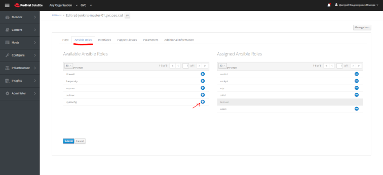

# Использование ролей Ansible в RH Satellite/Katello

!!! info
    Для применения ролей на зарегестрированых хостах в RH Satellite/Katello необходимо: добавить необходимые роли на хост или группу хостов, сконфигурировать параметры.
    
!!! help
    Все необходимые параметры указаны в документации по каждой роле.

## Пример

1. Для применения роли к хосту, необходимо выбрать хост и отредактировать его свойства выбрав `Edit`.

2. Далее на вкладке `Ansible Roles` можно включить или отключить необходимые роли для использования.

3. Во вкладке `Parameters` в разделе `Host Parameters` добавляются необходимые переменные.

4. Сохранив все значения можно запустить сценарии на исполнение.

!!! attention
    Имена роле указаны в файле README.md со ссылкой но документацию.

!!! note
    В примере конфигурируется один хоост, аналогичные действия производятся для группы хостов.
    
