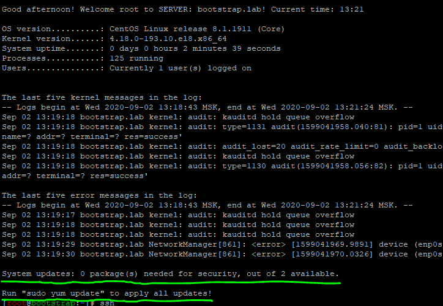
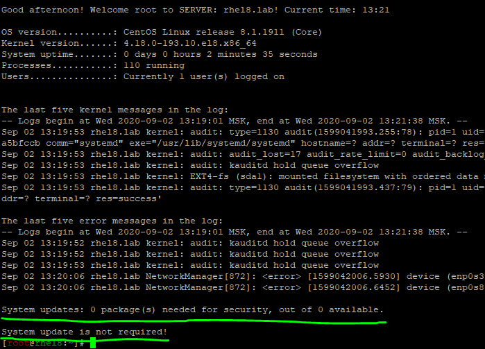

# Настройка SSHD на CentOS/RHEL с помощью Ansible

??? abstract
    1. [Общее описание](#общее-описание)
    2. [Параметры](#параметры)
    3. [Теги](#теги)
    4. [Примеры](#примеры)
    5. [Дополнительные материалы](#дополнительные-материалы)

## Общее описание
Роль для настройки SSH службы. При выполнение данного сценария создается новый конфигурационный файл по шаблону, копируется скрипт динамического приветствия motd, создается сервис проверки на доступные обновления, изменяется Bash Prompt.

## Параметры
|Название переменной    | Тип переменной | Значения по умолчанию | Описание                                                                                      |
|:----------------------|:--------------:|:----------------------------------------:|:---------------------------------------------------------------------------|
|sshd_use_dns           | string         | no                                       | Определяет будет ли при подключении разрешаться DNS имя клиента.           |
|sshd_ports             | array          | 22                                       | Задает порт или список для подключения к серверу.                          |
|sshd_listen            | array          | any                                      | Задает сетевой адрес по которому будет доступен сервис.                    |
|sshd_banner            | string         | none                                     | Определяет используемый баннер.                                            |
|login_root             | string         | no                                       | Определяет разрешено ли root'у подключатся по SSH.                         |
|gss_auth и gss_cleanup | string         | no                                       | GSSAPI предоставляет API для различных вариантов аутентификации в системе. |
|sshd_passwd_auth       | string         | yes                                      | Включает аутентификацию по паролю.                                         |
|sshd_pubkey_auth       | string         | yes                                      | Включает аутентификацию по ключу.                                          |
|user_accounts          | string         | $HOME                                    | Определяет как и где будут располагаться аутентификационные ключи.         |
|sshd_max_sessions      | string         | 5                                        | Максимальное количество соединений с одного IP.                            |
|sshd_max_auth          | string         | 3                                        | Максимальное количество неудачных аутентификаций.                          |
|sshd_alive_interval    | string         | 120 секунд                               | Время простоя клиента в секундах при неактивности до закрытия соединения.  |
|sshd_alive_count_max   | string         | 720                                      | Количество проверок доступности клиента до закрытия соединения.            |
|sshd_pmotd             | string         | no                                       | При подключение выводит содержимое /etc/motd.                              |
|sshd_plast             | string         | yes                                      | При подключение отображает информацию о последнем успешном входе.          |
|sshd_tkeep_alive       | string         | yes                                      | Включает поддержание соединения активным со стороны сервера.               |
|sshd_upam              | string         | no                                       | Разрешает запуск сервера под любым пользователем.                          |
|sshd_deny_users        | string         | ``smenaptk@10.144.*, smenaptk@10.160.*`` | Задает список пользователей которым не разрешён вход.                      |

!!! attention  
    ``'smenaptk@10.144.*'`` и ``'smenaptk@10.160.*'`` запрещают конектиться под учетной записью `smenaptk` из сетей 10.144.0.0/16, 10.160.0.0/16. При переопределение параметра *sshd_deny_users* переменная будет полностью перезаписана.

## Теги
|Тег                  | Описание                                          |
|:--------------------|:--------------------------------------------------|
|sshd_conf            | Настраивает конфигурационный файл SSHD.           |
|motd_banner          | Создает скрипт динамического приветствия `motd`.  |

## Примеры

!!! example "inventory/hosts"
    ```
    [example-servers]
    <host_name> ansible_ssh_host=<host_ip> ansible_ssh_user=<user_name_for_connect>

    [example-servers:vars]
    ansible_connection=ssh
    login_root='yes'
    sshd_banner='/etc/ssh/banner'
    ```

### С неустановленными обновлениями.


### С установленными обновлениями.


## Дополнительные материалы

-[SSH Server Configuration](https://www.ssh.com/ssh/sshd_config/)
